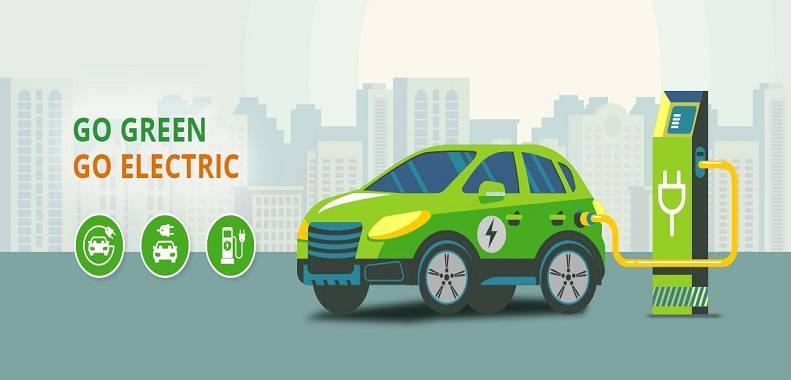

# ⚡ Electric Vehicle Sales Dashboard - India

A modern, interactive, and visually stunning data analytics dashboard built using **Python**, **Streamlit**, **Pandas**, **Machine Learning**, and **Seaborn/Matplotlib**.

> 🚗 This project showcases Electric Vehicle (EV) sales across Indian states, predicts future sales, and provides deep insights using visual storytelling and ML modeling.

---

## 📊 Features

- 🎯 Year-wise, state-wise EV sales trends
- 🧠 Predictive model using Random Forest Regressor
- 🌐 Fully interactive Streamlit dashboard with filters
- 📉 Visual analysis by vehicle category, type, and region
- 📦 Raw data explorer
- 💫 Smooth navigation with horizontal tabbed menu
- ⚙️ Sidebar filters for easy data slicing

---

## 🧱 Project Architecture

```
ev_sales_dashboard_project/
├── assets/                        # EV images, logo, animations
│   └── ev_banner.png
│
├── dashboard/                    # Streamlit dashboard UI
│   └── app.py
│
├── data/                         # Dataset
│   └── Electric Vehicle Sales by State in India.csv
│
├── notebooks/                    # Optional EDA notebooks
│   └── eda_analysis.ipynb
│
├── src/                          # Core logic (modular code)
│   ├── eda.py                    # All chart/plot functions
│   ├── model.py                  # ML model training logic
│   └── preprocess.py             # Data cleaning & encoding
│
├── requirements.txt             # Python dependencies
└── README.md                     # Project overview (this file)
```

---

## 🚀 Screenshots

### 📌 Dashboard - Home


### 📈 Sales Trend Visualizations
- Year-over-year EV growth
- Monthly and state-wise insights

### 🤖 Predictive Modeling
- Random Forest trained on encoded features
- Actual vs. Predicted EV sales line chart

---

## 🧠 Technologies Used

| Tool         | Purpose                        |
|--------------|----------------------------------|
| Python       | Core programming language       |
| Pandas       | Data manipulation               |
| Seaborn/Matplotlib | Beautiful plotting         |
| Scikit-learn | ML modeling                     |
| Streamlit    | Interactive web UI              |
| VS Code      | Development environment         |

---

## 🛠️ Setup Instructions

1. **Clone the repo**:
```bash
git clone https://github.com/JaykumarGirase11/Electric-Vehicle-Sales-by-State-in-India.git
cd Electric-Vehicle-Sales-by-State-in-India
```

2. **Install dependencies**:
```bash
pip install -r requirements.txt
```

3. **Run the app**:
```bash
streamlit run dashboard/app.py
```

---

## ⭐ If You Like It...

Don’t forget to ⭐ star the repo and share it with your network! 🙌

> _"Driving data into the electric future."_
